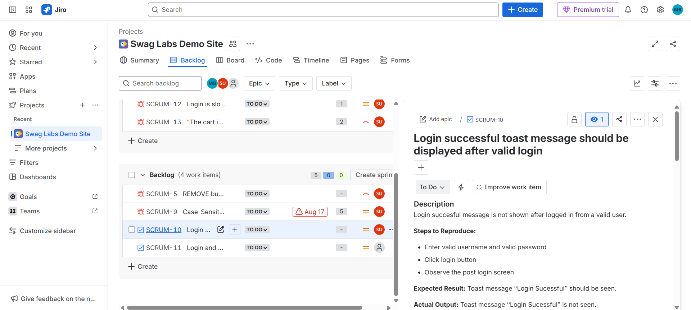

# Bug Report in Jira

## 🐞 Bug Report: Login Successful Toast Message Missing

### Bug Summary

__Title__: Login successful toast message not displayed after valid login

__Severity__: Low

**Priority**: Low

**Status**: Open

### Description

When a valid user logs in with correct credentials, the system should display a toast message confirming a successful login. However, the message is not displayed, which may lead to confusion for users about whether the login was successful

## Steps to Reproduce

* Launch the application.

* Navigate to the Login screen.

* Enter valid login credentials.

* Tap on the Login button.

## Expected Behavior

* After a successful login, a toast message should appear with the text:

* "Login successful"

* This ensures clear feedback to the user.

## Actual Behavior

* No toast message is displayed after a valid login.

* User is redirected to the home/dashboard screen without confirmation.

## Impact

* Reduces clarity of user experience.

* Users may attempt to log in multiple times, thinking the action did not complete.

## Screenshots / Logs

Bug evidence is attached in the repository under the /screenshots folder.

## Environment

**App Version**: v1.0.0

**Browser**: Chrome (latest version at time of test)

**OS**: Windows 11
